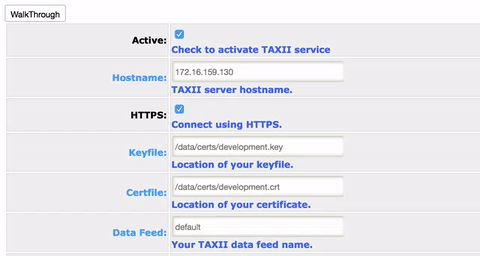

# OVERVIEW

This TAXII service allows you to send and receive content automatically between a MARTI instance and a TAXII server (in our testing we used a simple Yeti server). 

The current implementation of the taxii_services only allows connections to one taxii server.

# Initial setup

See documentation: HERE (**TODO: FILL ME OUT**)

# Updates from CRITs

* Removed manual taxii service option from TLOs (see [views.py](views.py))
* [Added auto polling and inboxing](#auto-polling-and-inboxing)
* [Added more fields to STIX message](#stix-expansion)
* [Added walkthrough to config menu](#walkthrough)
* [Various bug fixes](#bug-fixes)

# Auto polling and inboxing

This was done by adding threads for both polling and inboxing (see [auto.py](auto.py)). 
   
## Polling
This is a simple loop that continuously polls the taxii server for the specified feeds.
  
## Inboxing
Essentially the auto file pulls all the items that were modified since the last time. Then loop through and send them via TAXII if they are marked to be sent and are in the taxii_service list.

Currently the only TLO's that are sent are: domains, email, ips, campaings, and samples. More can be added by following the same structure show below, but they will need to be tested thoroughly.

```python
# Create a list of items that were recently modified
TLO = []
TLO.append([{'items': mongo_find('domains', {'modified': {'$gt': start}}, sort=[('modified',-1)])}, {'collection' : 'Domain'}])
TLO.append([{'items': mongo_find('email', {'modified': {'$gt': start}}, sort=[('modified',-1)])}, {'collection' : 'Email'}])
TLO.append([{'items': mongo_find('ips', {'modified': {'$gt': start}}, sort=[('modified',-1)])}, {'collection' : 'IP'}])
TLO.append([{'items': mongo_find('campaigns', {'modified': {'$gt': start}}, sort=[('modified',-1)])}, {'collection' : 'Campaign'}])
TLO.append([{'items': mongo_find('sample', {'modified': {'$gt': start}}, sort=[('modified',-1)])},{'collection' : 'Sample'}])
#Other TLOs that TAXII will send without error: pcaps/PCAP, raw_data/RawData, certificates/Certificate
```

When a user sets the releasability of an item, a flag is set that the taxii_service looks for. Once the item is sent, the flag is reset.

```python
def reset_releasebility_flag(items):

    for item in items:
        item.set_releasability_flag(flag=False)
        item.save(username='taxii')
```

Once a message is read in from polling the TAXII server and saved, the flag gets set so that any updates can be sent out.

```python
def set_releasability(self, indicators, feed):

    for indicator in indicators:
        if self.was_saved(indicator):
            set_releasability_flag(str(self.imported[indicator.id_][0]),
                                   str(self.imported[indicator.id_][1].id),
                                   'taxii', feed, self.package.id_)
    return
```

Additionally, if a TAXII message was received, the id is stored to help prevent duplication.
 
 
 
# STIX Expansion
Tightened up the way STIX messages were formed and added the following: 

    * Comments
    * TLP
    * Kill chain
    * Campaign (entire TLO)
    * Relationships
    * Sightings
    * Source
    * Sectors
    * RFI

The [handlers.py](handlers.py) file adds the items to the STIX message and the [parsers.py](parsers.py) file parses them back into the database.

The various additions are broken out into their own functions in both files. You can use them as examples to add more information to the STIX message.

Once you add a new function, make sure you add the call to the to_stix function in handlers and the parse_stix function in parsers.

# Walkthrough
Added helpful walkthrough to taxii_service config page. The main functionality was added in core, but you need to add the html specifics to each form item. More specifically you need to define the 'data-step' and 'data-intro' to utalize the walkthrough feature.

[forms.py](forms.py)

```python
auto_inbox = forms.BooleanField(required=False,
                            label="Auto Inbox",
                            initial=False,
                            help_text="Auto send Taxii feeds.",
                            widget=forms.CheckboxInput(
                                attrs={'data-step': '8',
                                'data-intro': 'Do you want MARTI to send data to the TAXII server automatically (if released)?'})
```


    
# Bug fixes

[\__init__.py](__init__.py)
    
```python
"""     
Allow for large XML fields

This is done by setting the XML_PARSER with the huge_tree value set to True.
"""

from lxml import etree
from libtaxii.common import set_xml_parser

XML_PARSER = etree.XMLParser(attribute_defaults=False,
                                      dtd_validation=False,
                                      load_dtd=False,
                                      no_network=True,
                                      ns_clean=True,
                                      recover=False,
                                      remove_blank_text=False,
                                      remove_comments=False,
                                      remove_pis=False,
                                      strip_cdata=True,
                                      compact=True,
                                      resolve_entities=False,
                                      huge_tree=True) # This is what is set to False by default

set_xml_parser(XML_PARSER)

```

[handlers.py](handlers.py)

```python
#Previously had 'IPv4' and 'IPv6' which didn't match the declarations
if obj.ip_type == IPTypes.IPV4_ADDRESS:
    obje.category = "ipv4-addr"
elif obj.ip_type == IPTypes.IPV6_ADDRESS:
    obje.category = "ipv6-addr"
elif obj.ip_type == IPTypes.IPV4_SUBNET:
    obje.category = "ipv4-net"
elif obj.ip_type == IPTypes.IPV6_SUBNET:
    obje.category = "ipv6-subnet"
```
    
# Notes
    
Source and feed must be same, have not tested with source and feed being different. 

<!---->


