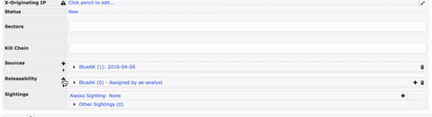

# OVERVIEW
---

This TAXII service allows you to send and receive content automatically between a MARTI instance and a TAXII server. It is currently known to work with a simple [Yeti Server](#yeti-taxii-server). 

The current implementation of the taxii_services only allows connections to one taxii server.

# Initial setup
---
See the [MARTI_Configuration_Guide_v08.pdf](MARTI_Configuration_Guide_v08.pdf) for specific instructions.

Section 9 discusses how to setup the taxii configuration in MARTI. Read the directions carefully to answer any questions you might have (refer to the TAXIIServiceConfigForm in [forms.py](forms.py) for additional help).

Section 8 discusses how to add a new feed to the taxii configuration in MARTI.

# Yeti (TAXII Server)
---
Section 6 discusses you how to add a new feed to the yeti server. 

The yeti server used can be found here: https://github.com/TAXIIProject/yeti

It is recommended to set the server up with SSL (which is not how it comes out of the box).

# Updates from CRITs
---
* Removed manual taxii_service option from TLOs (see [views.py](views.py))
* [Added auto polling and inboxing](#auto-polling-and-inboxing)
* [Added more fields to STIX message](#stix-expansion)
* [Various bug fixes](#bug-fixes)

# Auto polling and inboxing
---

This was done by adding threads for both polling and inboxing (see [auto.py](auto.py)). 

---   
## Polling

This is a simple loop that continuously polls the TAXII server for the specified feeds.

---  
## Inboxing

The auto file pulls all the items that have been modified since the last pull. Each item is then checked to see if they are marked to be sent and are in the taxii_service list. If they pass both of those checks, they are sent via TAXII.

Currently the only TLO's that are sent are the domains, email, ips, campaigns, and samples. More TLO's can be added and sent if you follow the same structure as shown below. However, thorough testing will need to be performed to ensure that these new items can be sent.

```python
# Create a list of items that were recently modified
TLO = []
TLO.append([{'items': mongo_find('domains', {'modified': {'$gt': start}}, sort=[('modified',-1)])}, {'collection' : 'Domain'}])
TLO.append([{'items': mongo_find('email', {'modified': {'$gt': start}}, sort=[('modified',-1)])}, {'collection' : 'Email'}])
TLO.append([{'items': mongo_find('ips', {'modified': {'$gt': start}}, sort=[('modified',-1)])}, {'collection' : 'IP'}])
TLO.append([{'items': mongo_find('campaigns', {'modified': {'$gt': start}}, sort=[('modified',-1)])}, {'collection' : 'Campaign'}])
TLO.append([{'items': mongo_find('sample', {'modified': {'$gt': start}}, sort=[('modified',-1)])},{'collection' : 'Sample'}])
#Other TLOs that TAXII will send without error: pcaps/PCAP, raw_data/RawData, certificates/Certificate
```

When a user sets the releasability of an item, a flag is set that the taxii_service looks for. Once the item is sent, the flag is reset.

```python
def reset_releasebility_flag(items):

    for item in items:
        item.set_releasability_flag(flag=False)
        item.save(username='taxii')
```

Once a message is read in from polling the TAXII server and saved, the flag gets set so that any updates can be sent out.

```python
def set_releasability(self, indicators, feed):

    for indicator in indicators:
        if self.was_saved(indicator):
            set_releasability_flag(str(self.imported[indicator.id_][0]),
                                   str(self.imported[indicator.id_][1].id),
                                   'taxii', feed, self.package.id_)
    return
```

Additionally, if a TAXII message was received, the id is stored to help prevent duplication.
 

 
# STIX Expansion
---
Tightened up the way STIX messages were formed and added the following information to each message. 

    * Comments
    * TLP (Proper STIX Usage)
    * Kill chain (Proper STIX Usage) 
    * Campaign (entire TLO) (Proper STIX Usage)
    * Campaign (associated) (Proper STIX Usage)
    * Relationships (Proper STIX Usage)
    * Sightings (Proper STIX Usage)
    * Source (Proper STIX Usage)
    * Sectors 
    * RFI

The [handlers.py](handlers.py) file adds the items to the STIX message and the [parsers.py](parsers.py) file parses them back into the database.

---
## Adding new items to the STIX message

For every item added, there is a function for converting to (to_stix_XX) and parsing (parse_XX) STIX messages. Use these as examples to add more items to the STIX message. **The most useful information can be found in the cybox/stix documentation ([links](#useful-links-for-development)).**

It is recommended to try and adhere to the STIX standards, but there will be times where there isn't a 'STIX' way to add a specific piece of information. In this event, adding that information via a related indicator has been a good solution.

---
### MARTI -> STIX

The [handlers.py](handlers.py) file adds the items to the STIX message. 

Once you add a new to_stix_XX function, make sure you add the call to the to_stix function in handlers.py.

```python
def to_stix(obj, items_to_convert=[], loaded=False, bin_fmt="raw", ref_id=None):
    """ Converts a CRITs object to a STIX document."""
    ...
    elif obj_type in obs_list: # convert to CybOX observable
            camp = to_stix_campaign(obj)
            comm =  to_stix_comments(obj)
            rel = to_stix_relationship(obj)
            sight = to_stix_sightings(obj)
            ...
            for ob in stx:
                ind.add_observable(ob)
                ind.sightings.append(sight)
                for each in camp:
                    ind.add_related_campaign(each)
                for each in comm:
                    ind.add_related_indicator(each)
```
As you can see, first each to_stix_XX function is called (always taking in obj). Then, depending on what that function returns depends on how it is added to the STIX message. 

For example, if there is a specific stix field (such as sightings), it is added to the appropriate place. Otherwise, the information is added as a related indicator (such as comments). 

Each to_stix_XX function can be used as a reference to get started on a new function. 

---
### STIX -> MARTI

The [parsers.py](parsers.py) file parses them back into the database.

Once you add a new parser function, make sure you add the call to the parse_stix function in parsers.

```python
def parse_stix(self, reference='', make_event=False, source=''):
    """ Parse the document. """
    ...
    if self.package.indicators:
            res = self.parse_indicators(self.package.indicators)
            ...
            self.parse_sightings(self.package.indicators)
            self.parse_kill_chain(self.package.indicators)
            self.parse_rfi(self.package.indicators)
            if self.package.campaigns:
                self.parse_related_campaigns(self.package.indicators, self.package.campaigns)
            if self.package.stix_header:
                self.parse_tlp(self.package.indicators, self.package.stix_header)
            self.set_releasability(self.package.indicators, source)
```

As you can see, most of the functions will take in the list of indicators. The two exceptions are for campaigns and tlp. Campaigns are stored in a seperate campaign indicator. TLPs are stored in the STIX header; meaning it applies to the ENTIRE STIX message, not per indicator.

You can look at any of the parse_XX functions to see the proper structure of future parsing functions. 

In general, each function starts by looping through each indicator and checking to see if it was saved. If it was saved, the obj_id and obj_type can safely be grabbed.

```python
def parse_comments(self, indicators):
    ...
    for indicator in indicators:
        if self.was_saved(indicator):
            obj_id = self.imported[indicator.id_][1].id
            obj_type = self.imported[indicator.id_][0]
```

Some items need to call the actual object to update it. This also gives the added benefit of being able to grab the objects url_key. 

```python
def parse_relationship(self, indicators):
    ...
    for indicator in indicators:
        if self.was_saved(indicator):
            obj = class_from_id(str(self.imported[indicator.id_][0]), str(self.imported[indicator.id_][1].id))
            ... 
            obj.get_url_key()
```
---
## Useful links for development

http://stixproject.github.io/documentation/

https://stix.readthedocs.io/en/stable/index.html

http://cybox.readthedocs.io/en/latest/index.html

https://cyboxproject.github.io/documentation/suggested-practices

https://stixproject.github.io/documentation/suggested-practices/
    
# Bug fixes
---
[\__init__.py](__init__.py)
    
```python
"""     
Allow for large XML fields

This is done by setting the XML_PARSER with the huge_tree value set to True.
"""

from lxml import etree
from libtaxii.common import set_xml_parser

XML_PARSER = etree.XMLParser(attribute_defaults=False,
                                      dtd_validation=False,
                                      load_dtd=False,
                                      no_network=True,
                                      ns_clean=True,
                                      recover=False,
                                      remove_blank_text=False,
                                      remove_comments=False,
                                      remove_pis=False,
                                      strip_cdata=True,
                                      compact=True,
                                      resolve_entities=False,
                                      huge_tree=True) # This is what is set to False by default

set_xml_parser(XML_PARSER)

```

[handlers.py](handlers.py)

```python
#Previously had 'IPv4' and 'IPv6' which didn't match the declarations
if obj.ip_type == IPTypes.IPV4_ADDRESS:
    obje.category = "ipv4-addr"
elif obj.ip_type == IPTypes.IPV6_ADDRESS:
    obje.category = "ipv6-addr"
elif obj.ip_type == IPTypes.IPV4_SUBNET:
    obje.category = "ipv4-net"
elif obj.ip_type == IPTypes.IPV6_SUBNET:
    obje.category = "ipv6-subnet"
```
    
# Notes
---
Source and feed must be same, have not tested with source and feed being different. 


